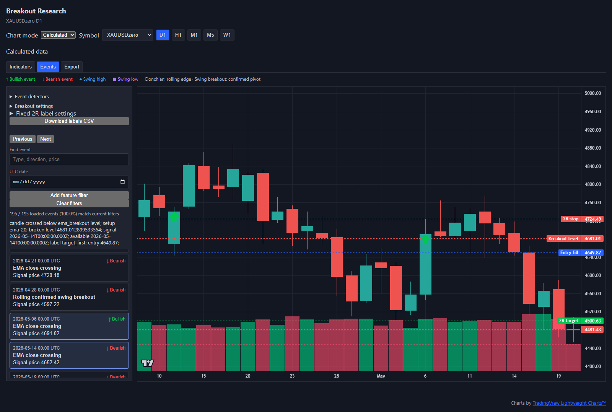
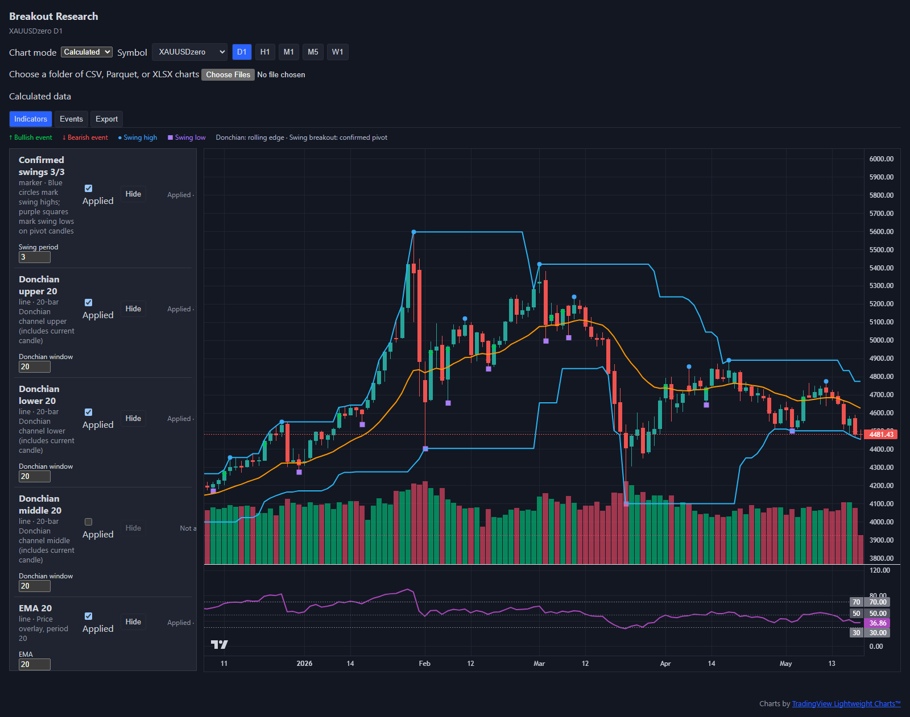
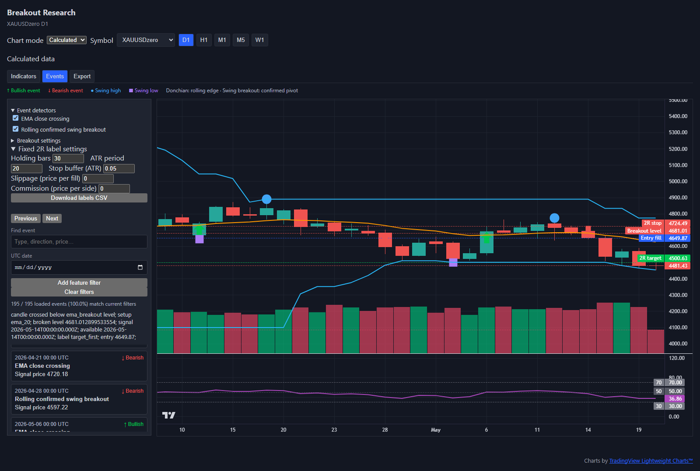
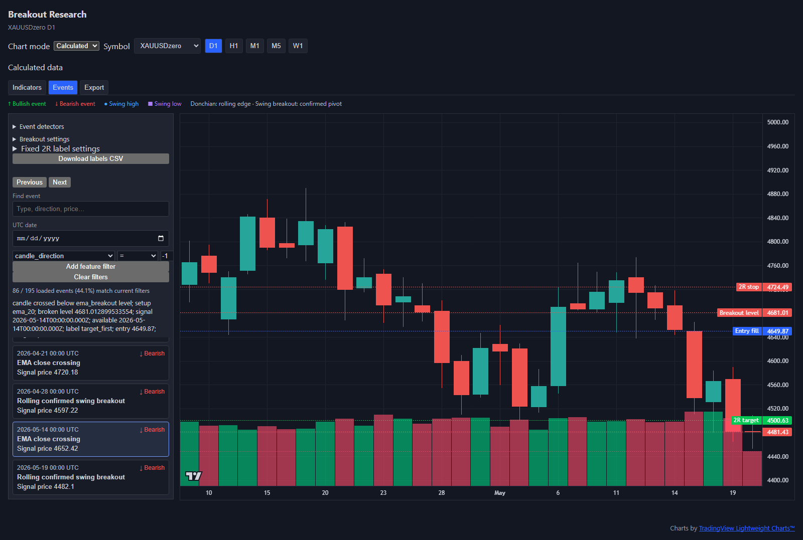
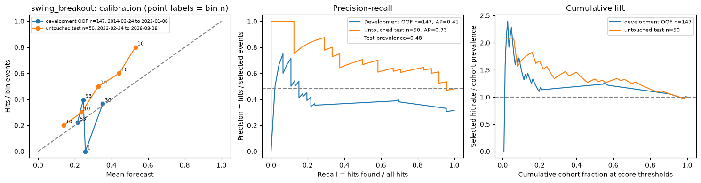
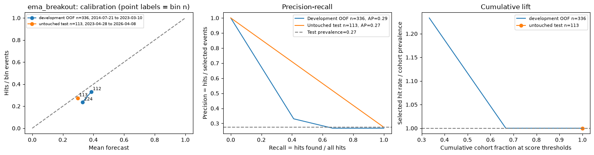
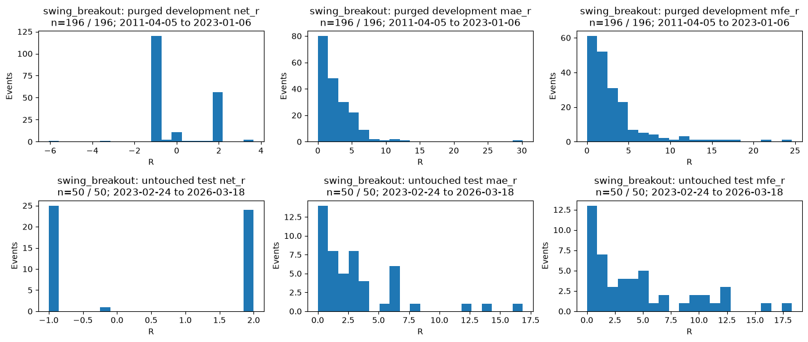

# Breakout Research

**An end-to-end, event-driven quant research demo.** This repository is a focused slice of a larger research project. It demonstrates the path from validating market bars and designing signal-time features through breakout detection, fixed 2R outcome labels, interactive review, export, and a small supervised-learning experiment. It is a research workflow demonstration, not a deployable trading strategy.



| Stage | What this demo shows |
| --- | --- |
| Market data | CSV, Parquet, and XLSX ingestion; UTC normalization and explicit OHLCV validation |
| Features | Timestamp-aligned, nullable calculations including EMA, ATR, RSI, MACD, Donchian channels, confirmed swings, normalized candle measurements, rolling overlap, and volume |
| Events | EMA close crossings and breakouts of previously confirmed swing levels, with configurable detector settings |
| Labels and review | Next-bar entry, ATR-buffered stop, fixed 2R target, finite horizon, barrier-order handling, chart price lines, and signal-time event filters |
| Research | Separate event cohorts, chronological and purged validation, a prevalence baseline, simple model selection, and untouched-test assessment |

The viewer uses FastAPI, pandas, PyArrow, and TradingView Lightweight Charts. The [research notebook](ML/breakout_research.ipynb) uses scikit-learn, XGBoost, and Matplotlib. **Market data is supplied by the user and is not included in this repository.**

## The workflow in the viewer

**Feature design and visualization.** The Indicators panel applies chart views independently of export columns. This capture shows confirmed swing markers, Donchian bands, an EMA overlay, volume, and an RSI pane on the same daily series.



**Event detection and labeling.** The two detector switches and label settings below are live controls. Selecting a labeled event draws its modeled entry fill, stop, target, and broken level when available. The selected-event record also exposes signal and availability times, label status, return in R, and MAE/MFE. Missing label prices have no chart line.



**Signal-time filtering.** Feature conditions update the event list and chart markers. Here, `candle_direction = -1` narrows **195 loaded events to 86**. This is the loaded chart window, not the full research cohort.



## Research summary: XAUUSDzero daily breakouts

**Question.** Do signal-time features rank fixed 2R target-first outcomes for EMA and confirmed-swing breakouts in XAUUSDzero daily bars? The historical source has SHA-256 fingerprint `473808c54e9cb2cdfc292524e59f94414f6aeb1b3fa2d1e9e802f3f19e0a7a89`. It is a single MT5-style market export, not an independently verified execution record.

**Method.** The existing detectors and 30-bar labels yield 572 EMA and 252 swing events. Of these, 565 and 247 respectively have complete, unambiguous labels and finite signal-time predictors. Eight registered normalized features plus direction enter the models. The last 20% of eligible events is reserved as chronological test; development is purged of outcomes reaching test. Three expanding development folds, with purged training windows, select the model by mean Brier score. A favorable probability cutoff is selected by validation lift with at least 10 validation events; the untouched test is assessed once. Baseline Brier comes from a prevalence model fitted on development.

The development count is **after purging events whose 30-bar outcomes reach the test boundary**. Out-of-fold (OOF) validation predictions come from expanding folds within development; they are not an additional cohort.

| Detector | Eligible | Development after purge | OOF validation | Untouched test | Test dates (UTC) |
| --- | ---: | ---: | ---: | ---: | --- |
| EMA | 565 | 449 | 336 | 113 | 2023-04-28 to 2026-04-08 |
| Confirmed swing | 247 | 196 | 147 | 50 | 2023-02-24 to 2026-03-18 |

| Detector | Selected model | Test Brier: baseline / model ↓ | Test AP / prevalence ↑ | Validation cutoff (support) | Test selected (hits) |
| --- | --- | ---: | ---: | ---: | ---: |
| EMA | Prevalence | 0.1996 / 0.1996 | 0.2743 / 0.2743 | 0.3853 (112) | 0 (0) |
| Confirmed swing | Shallow XGBoost | 0.2835 / 0.2329 | 0.7264 / 0.4800 | 0.2474 (80) | 34 (21) |

**Finding and uncertainty.** The swing model ranks this single holdout better than its prevalence baseline, while EMA selects the prevalence model and its validation cutoff selects **zero** test events, so an EMA test-condition hit rate or lift is undefined. Swing's selected 21/34 test hit rate is descriptive. AP should be read beside cohort prevalence. Overlapping 30-bar outcomes, one historical market and test period, small selected counts, fixed barriers, zero modeled spread/slippage/commission, and possible regime change limit uncertainty estimates and forward inference. These labels do not establish live profitability.

The following figures are extracted from the saved notebook outputs. Calibration points report bin support; development and untouched-test cohorts are shown separately.





The swing outcome plot below is one example; both cohorts are documented in the linked notebook. It shows net R and adverse/favorable excursions. MAE and MFE span the available observation horizon, including bars after an earlier exit, and are never model inputs.



**Reproduce the research.** Install the optional ML dependencies with `pip install -e ".[ml]"`, edit `SOURCE_PATH` in the notebook's top config cell (or set `BREAKOUT_SOURCE` as an optional override), then run the linked notebook from top to bottom. Its top configuration cell exposes feature periods, stable `FEATURE_KEYS` for selecting predictors, detectors, labels, model settings, and an optional figure output location. Predictor column names are resolved from those keys after periods are applied, so changing `FEATURE_SETTINGS` updates names such as `atr_20_to_close` to `atr_14_to_close`. Saved outputs include the holdout table, both cohorts' figures, and audit details. Dataset fingerprints and run settings are checked before analysis. Prior research exports must be moved deliberately before regeneration from a different source or configuration.

## Research design and boundaries

- **Point-in-time inputs:** Eight normalized feature columns and event direction are available at signal time. Raw OHLC, timestamps, outcomes, returns, and excursion measures are excluded from model inputs.
- **Events and labels:** An EMA event closes across its signal-bar EMA; a swing event closes across an earlier confirmed pivot. Signals are evaluated after the signal bar, with a **modeled next-open entry**. The stop sits beyond that bar's extreme by 0.05 × ATR(20), and the target is 2R away over a 30-bar entry-inclusive horizon. Gaps use their opening price; bars that touch both barriers without an opening resolution are ambiguous; incomplete windows are censored. Default modeled slippage and commission are zero.
- **Evaluation:** EMA and swing events are separate cohorts. A prevalence baseline, a simple tree, and small XGBoost candidates are compared using three expanding, purged development folds. The final 20% chronological test window is scored once. Complete, unambiguous, finite-feature events alone enter modeling.
- **Limits:** This is one gold daily series and one historical test period. Overlapping event horizons, small selected counts, regime changes, unmodeled spread and transaction costs, and absent portfolio sizing or execution simulation limit inference. The reported R values are label outcomes, not live or portfolio returns.

## Reproduce the viewer

Python 3.11+ is required. Supply your own CSV, Parquet, or XLSX market bars with UTC-compatible timestamps and OHLCV columns. The viewer validates the selected source and reports malformed rows. After starting the viewer, choose a folder in the browser or set `BARS_DATA_ROOT` to your market-data folder before launch. The chart library loads from a CDN.

```powershell
python -m venv .venv
.\.venv\Scripts\Activate.ps1
pip install -e .
python -m uvicorn app.main:app --reload
```

Open <http://127.0.0.1:8000>. On macOS or Linux, activate the virtual environment with `source .venv/bin/activate` and set the variable with `export BARS_DATA_ROOT=/path/to/market-data`. Optional `SOURCE_TIMEZONE` applies to naive source timestamps; its default is UTC. The viewer supports interactive indicators, event selection and filters, and CSV/Parquet feature and event exports with metadata sidecars.

In **Calculated** mode, use **Choose a folder of CSV, Parquet, or XLSX charts** to select local files without restarting the server. Files named like `EURUSD_H1.csv` or `EURUSD_H1_max_bars.csv` appear in the symbol and timeframe selectors; bars, events, and exports then use the chosen folder. The browser uploads these files to a temporary server session. Duplicate filenames or symbol/timeframe pairs produce an import error. Choose the folder again after a server restart or in a new browser tab.

## Implementation and verification

The backend keeps source loading, feature calculations, event detection, labeling, and API transport separate. Timestamp-aligned nullable feature tables make missing warm-up values explicit. Event IDs are deterministic for the dataset and detector configuration; export sidecars record source hashes, feature versions, and label settings. Chart views and export columns are chosen independently.

To run the repository checks, install the development dependencies with `pip install -e ".[dev,ml]"`, then install the browser test tools with `npm ci` and `npx playwright install chromium`.

```text
pytest
ruff format --check .
ruff check .
mypy
npm run format:check
npm run lint
npm run typecheck
```
